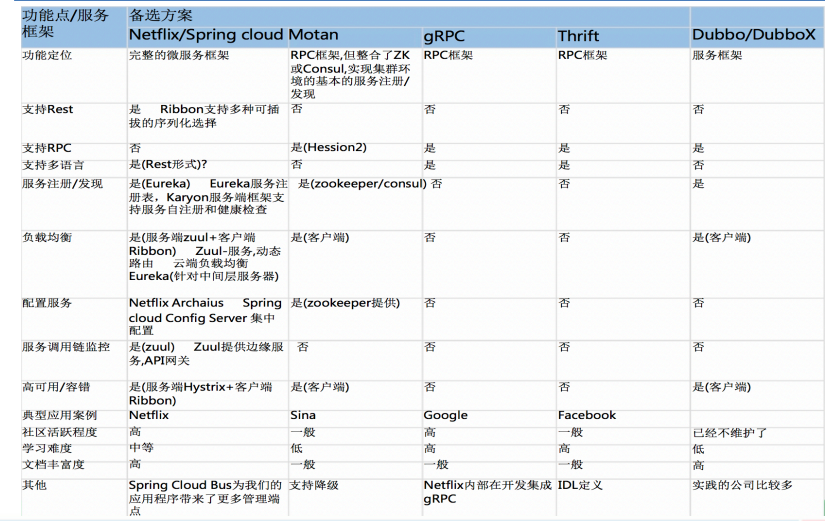

# SpringCloud概述

## [#](#是什么)是什么

SpringCloud，基于SpringBoot提供了一套微服务解决方案，包括服务注册与发现，配置中心，全链路监控，服务网关，负载均衡，熔断器等组件，除了基于NetFlix的开源组件做高度抽象封装之外，还有一些选型中立的开源组件。

SpringCloud利用SpringBoot的开发便利性巧妙地简化了分布式系统基础设施的开发，SpringCloud为开发人员提供了快速构建分布式系统的一些工具，包括配置管理、服务发现、断路器、路由、微代理、事件总线、全局锁、决策竞选、分布式会话等等,它们都可以用SpringBoot的开发风格做到一键启动和部署。

SpringBoot并没有重复制造轮子，它只是将目前各家公司开发的比较成熟、经得起实际考验的服务框架组合起来，通过SpringBoot风格进行再封装屏蔽掉了复杂的配置和实现原理，最终给开发者留出了一套简单易懂、易部署和易维护的分布式系统开发工具包

SpringCloud=分布式微服务架构下的一站式解决方案，是各个微服务架构落地技术的集合体，俗称微服务全家桶

## [#](#和springboot的关系)和springboot的关系

SpringBoot专注于快速方便的开发单个个体微服务。

SpringCloud是关注全局的微服务协调整理治理框架，它将SpringBoot开发的一个个单体微服务整合并管理起来， 为各个微服务之间提供，配置管理、服务发现、断路器、路由、微代理、事件总线、全局锁、决策竞选、分布式会话等等集成服务

SpringBoot可以离开SpringCloud独立使用开发项目，但是SpringCloud离不开SpringBoot，属于依赖的关系.

SpringBoot专注于快速、方便的开发单个微服务个体，SpringCloud关注全局的服务治理框架。

## [#](#框架对比)框架对比

上面是我网上找的图片，通过对比不难发现，springcloud相对其他比较完善，另外图中dubbo的维护状态是错的，duboo已经重新开始维护了